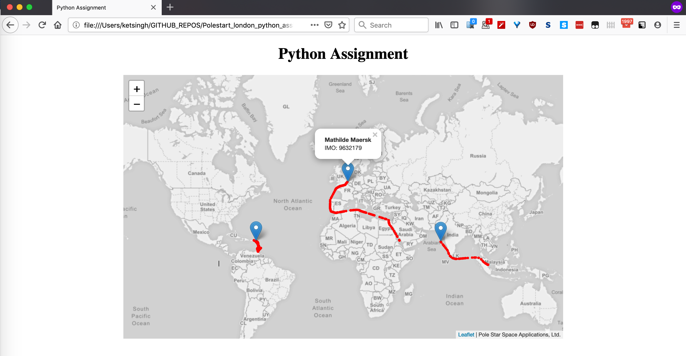

## Polestar - Python Assignment

Build on the below tech-stack:
- Python3 _(v3.7)_
- Flask
- Sqlite3
- SqlAlchemy
- Docker

#### Base Data Used:
|     Ship Name     |   IMO   |
------------------- | --------
| Mathilde Maersk   | 9632179 |
| Australian Spirit | 9247455 |
| MSC Preziosa      | 9595321 |

<br>  

### API(s)    
#### External APIs [for UI]:    
- **ships** `/api/ships/`    
    Returns a list of ships.
    - Methods: _GET, DELETE_

    Example:
    ```bash
    curl -X GET "http://localhost:5010/api/shipsdata/"
    curl -X DELETE "http://localhost:5010/api/shipsdata/"
    ```

- **positions** `/api/positions/<imo>`   
    Returns a list of pairs of latitudes & longitudes for a given imo, is descending order or occurrance.
    - Methods: _GET_  
    
    Example:    
    ```bash
    curl -X GET "http://localhost:5010/api/positions/9595321"
    ```

- **test** `/test/`  
    To test if your local setup is working or not.
    - Methods: _GET_
    
    Example:
    ```bash
     curl -X GET "http://localhost:5010/test/"
    ```
    
    
### Internal APIs:  
There are some internal API's as well, for more db control and simplicity sake.  
Read more about them [here](README_more.md).

<br>

---

## Steps to run (detailed)

1. Clone this repo:
    ```bash
    git clone https://github.com/KetanSingh11/Polestart_london_python_assignment.git
    ```

2. Navigate to the folder:
    ```bash
    cd Polestart_london_python_assignment/polestar_app
    ```

3. Create Docker container locally:   
    **NOTE:** make sure there is no `polestar_db.db` file under the `./db` folder. If exists, delete it before proceeding.
    ```bash
    docker build -t polestar_app:latest .
    ```
    
4. Start the docker container:   
   __This binds localhost port 5010 to docker port 8010.__    
    ```bash
    docker run -d -p 5010:8010 --name my_polestar_app polestar_app:latest
    docker run -it -p 5010:8010 --name my_polestar_app polestar_app:latest
    ```

5. Now, test if the setup is working fine and connections are reaching the docker container (hopefully :)).
    ```bash
    curl -X GET "http://localhost:5010/test/"
    ```    

    Hopefully, you will see a response, like below:
    ```bash
    "Hello World!"
    ```    

    
At this point the database inside the container is `blank`. Lets fill it.   
1. Init the DB.   
   This will load the csv file [positions.csv](../positions.csv) and insert it into the database.
    ```bash
    curl -X GET "http://localhost:5010/api/init_db/"
    ```   
     
2. Finally, open the file [index.html](../index.html) in any web browser of your choice.
   You should be presented with the below page!!

    
    
<br>

## TL;DR

If you have read this far, and are confused with the steps, I have a helper script for you :wink:    
Just run [build.sh](build.sh) on your terminal, and everything will run in one go.   

Type in terminal:
```bash
./build.sh
```


<br>
<br>
<br>  
  
> ###### No part of this code repository may be copied, reproduced, stored in a retrieval system, or transmitted, in any form or by any means, electronic, mechanical, photocopying, recording, or otherwise, without the prior written permission of the repository owner.    
<div style='text-align: center;'> &copy; 2019, Ketan Singh | All Rights Reserved </div>     
